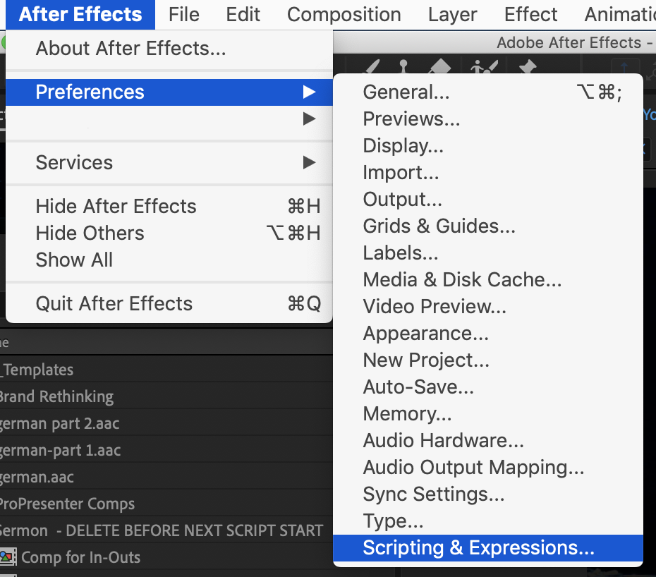
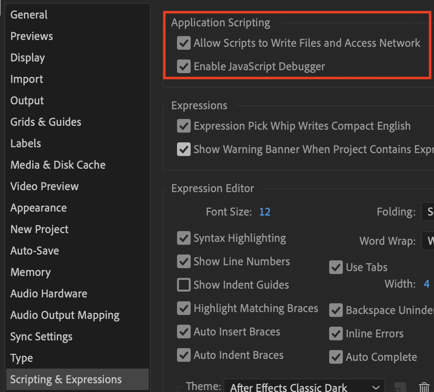

# Saddleback Video i18n

This app, created to help with the creation of translated video files, exists to fulfill these purposes:

* Load a CSV file which represents content to use for creating single or bilingual lower thirds, scripture screens or other full screen slides.
* Review an original video footage from Saddleback Valley Community Church in California to find footage for scriptures, lower thirds or other full screen slides.
* Create several versions of a video with different languages options creating lower thirds, scripture screens or other full screen slides with this certain language.

This script is written in ExtendScript, a JavaScript framework used to automize activities within the Adobe Creative Suite. This script is being used for Adobe After Effects only.

## How to use this script

Install the script as mentioned in the `Getting started` section. Before you can use it you should have an After Effects file which includes the following data:

* All neccessary templates for the footages to be created (lower thirds, scripture, etc.). To be identified as a template
* The original video file either as an MP4 or as a Dynamic Link to Adobe Premiere
* The file `config/settings.json` should be reviewed as it defines which compositions needs to be created

## Getting Started

In your Applications folder search for `Adobe After Effects CC ...`. You will find a folder `Scripts/ScriptUI Panels` there.

In this folder you copy the `start.js` file from the folder `src`. Rename the file to `Saddleback Video i18n 2.4.5.jsx`.

Also download the folder `media_controls` from this repository and move it into the `Scripts/ScriptUI Panels` folder as well.

In your home folder (the main folder for the user `~`) you create a folder `Saddleback-Video-i18n-Functions`. Download all subfolders from the `src` folder from this repository into this supporting functions folder.

Open After Effects and go to the scripting preferences:



Set the options for enabling the script to write files and access the network:



Now you are ready to use the script. Just restart After Effects. You will then find the script in the `Window` menu.

## Any problems?

The script will show you alert boxes if something is not going well. Follow the instructions shown in these messages. If you don't know how to fix it, just raise an issue in this repository. Thanks in advance.

## Contributing

Fix an issue, make a pull request, and Bob's your uncle.

## Object structure

The script is using the name space `sbVideoScript`. All functions and data are stored here. The script is not packaged so it loads all necessary functions during runtime. Thus it uses the `importScript(filename)` function to load the relevant script. If the script is loaded it sets reminders in `sbVideoScript.filesLoaded` so that the same script is only being loaded once.

```js
sbVideoScript = {
    filesLoaded: {
        'function1': true               // stores information which function was loaded already
        ...
    },
    settings: { ... },                  // stores the script's settings (see config/settings.json)
    linesOfCSV: [...],                  // stores the lines of the CSV file in an array
    mediaFootage: {...},                // stores the main footage (the original video file)
    columnPositions: {                  // stores names and positions of columns within the loaded CSV file
        'requiredField1Index': 1,       // for the required fields it stores it's name with Index as an extension and the column number where it is found within the CSV file
        layers: [{
            layerName: 'English Text',  // for the non-required columns found in the CSV it stores the column name and its column number
            layerIndex: 2
        }]
    },
    templates: [...],                   // all expected templates are mentioned in config/settings.json in settings.compositionTemplates; they are loaded as compositions into this array
    mainCompFolder: {...},              // reference to the folder for the main compositions
    trashFolder: {...},                 // reference to the trash folder
    createSlidesButton: {...},          // UI button object that will create the videos and its slides; it will be enabled or disabled here and there
    contentList: {...}                  // listbox representing the lines of the CSV file
    templateList: {...},                // dropdownlist with the list of templates
    groupInOutButtons: {...},           // UI group to store the buttons for setting the in/out positions for layers
}
```
